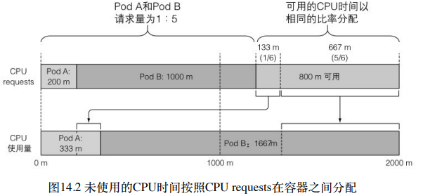
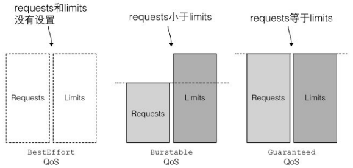
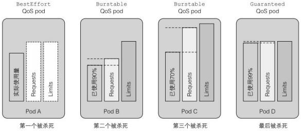
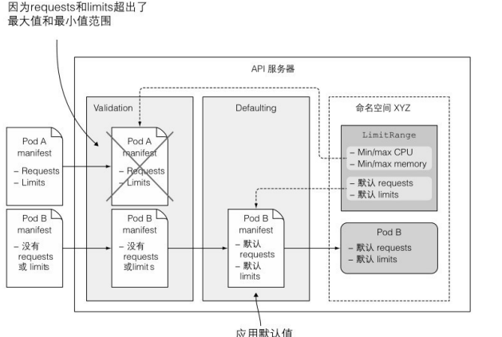

# 第 14 章 计算资源管理

## 1. 为容器申请资源

设置 pod 的容器资源申请量保证了每个容器能够获得它所需要资源的最⼩量。

```yaml
apiVersion: v1
kind: Pod
metadata:
  name: requests-pod
spec:
  containers:
    - name: main
      image: busybox
      command:
        - dd
        - if=/dev/zero
        - of=/dev/null
      resources:
        requests:
          memory: "10Mi" # 容器申请10MB内存
          cpu: "200m" # 容器申请200毫核（1个cpu核心时间的1/5）
```

从图 14.1 中可见，节点上部署了三个 pod。它们共申请了节点 80%的 CPU 和 60%的内存资源。图右下⽅的 pod D 将⽆法调度到这个节点上，因为它 25% 的 CPU requests ⼤于节点未分配的 20%CPU。⽽实际上，这与当前三个 pod 使⽤ 70%的 CPU 没有什么关系。

### 调度器如何利⽤ pod requests 为其选择最佳节点

有两个基于资源请求量的优先级排序函数：LeastRequestedPriority 和 MostRequestedPriority。前者优先将 pod 调度到请求量少的节点上（也就是拥有更多未分配资源的节点），⽽后者相反，优先调度到请求量多的节点（拥有更少未分配资源的节点）。它们都只考虑资源请求量，⽽不关注实际使⽤资源量。调度器只能配置⼀种优先级函数。配置调度器使⽤ MostRequestedPriority 函数，可以在为每个 pod 提供⾜量 CPU/内存资源的同时，确保 Kubernetes 使⽤尽可能少的节点。通过使 pod 紧凑地编排，⼀些节点可以保持空闲并可随时从集群中移除。由于通常会按照单个节点付费，这样便可以节省⼀笔开销。

### 查看节点资源总量

```bash
$ kubectl describe nodes
Name:               minikube
...
Capacity:
  cpu:                4
  ephemeral-storage:  82512260Ki
  hugepages-1Gi:      0
  hugepages-2Mi:      0
  memory:             4029576Ki
  pods:               110
Allocatable:
  cpu:                4
  ephemeral-storage:  82512260Ki
  hugepages-1Gi:      0
  hugepages-2Mi:      0
  memory:             4029576Ki
  pods:               110
  ...
```

### 创建⼀个不适合任何节点的 pod

再次创建一个 800 毫核的 pod。共申请了 1000 毫核 cpu，还剩 capacity cpu - 1 核。申请剩下的核数。查看 pod 状态。

```bash
$ kubectl get po requests-pod-3
NAME             READY   STATUS    RESTARTS   AGE
requests-pod-3   0/1     Pending   0          26s
```

kubectl describe pod 查看为什么 pod 卡在 Pending 状态

```bash
$ kubectl describe po requests-pod-3
...
Events:
  Type     Reason            Age                  From               Message
  ----     ------            ----                 ----               -------
  Warning  FailedScheduling  59s (x4 over 4m11s)  default-scheduler  0/1 nodes are available: 1 Insufficient cpu.
```

kubectl describe node 检查节点已分配资源

```bash
$ kubectl describe node
...
Allocated resources:
  (Total limits may be over 100 percent, i.e., overcommitted.)
  Resource           Requests       Limits
  --------           --------       ------
  cpu                1765m (44%)    100m (2%)
  memory             194660Ki (4%)  190Mi (4%)
  ephemeral-storage  0 (0%)         0 (0%)
  hugepages-1Gi      0 (0%)         0 (0%)
  hugepages-2Mi      0 (0%)         0 (0%)
```

发现比部署的两个 pod 申请量多。在 kube-system 命名空间内有三个 pod 明确申请了 CPU。删除另⼀个 pod 后 pod 已正常调度。

### CPU requests 如何影响 CPU 时间分配

CPU requests 不仅仅在调度时起作⽤，它还决定着剩余（未使⽤）的 CPU 时间如何在 pod 之间分配。正如图 14.2 描绘的那样，因为第⼀个 pod 请求了 200 毫核，另⼀个请求了 1000 毫核，所以未使⽤的 CPU 将按照 1:5 的⽐例来划分给这两个 pod。如果两个 pod 都全⼒使⽤ CPU，第⼀个 pod 将获得 16.7%的 CPU 时间，另⼀个将获得 83.3%的 CPU 时间。



## 2.限制容器的可用资源

即容器可以消耗资源的最⼤量

### 设置容器可使⽤资源量的硬限制

如果不对内存进⾏限制，⼯作节点上的容器（或者 pod）可能会吃掉所有可⽤内存。

#### 创建⼀个带有资源 limits 的 pod

⼀个包含 CPU 和内存硬限制的 pod:limited-pod.yaml

```yaml
apiVersion: v1
kind: Pod
metadata:
  name: limited-pod
spec:
  containers:
    - name: main
      image: busybox
      command:
        - dd
        - if=/dev/zero
        - of=/dev/null
      resources:
        limits:
          memory: "1" # 容器允许最大使用1核
          cpu: "20Mi" # 容器允许最大食用20MB内存
```

#### 可超卖的 limits

与资源 requests 不同的是，资源 limits 不受节点可分配资源量的约束。所有 limits 的总和允许超过节点资源总量的 100%（见图 14.3）。换句话说，资源 limits 可以超卖。如果节点资源使⽤量超过 100%，⼀些容器将被杀掉。

### 超过 limits

CPU 是可压缩资源，当进程不等待 IO 操作时消耗所有的 CPU 时间是⾮常常见的。正如我们所知道的，对⼀个进程的 CPU 使⽤率可以进⾏限制，因此当为⼀个容器设置 CPU 限额时，该进程只会分不到⽐限额更多的 CPU ⽽已。
当进程尝试申请分配⽐限额更多的内存时会被杀掉（我们会说这个容器被 OOMKilled 了，OOM 是 Out Of Memory 的缩写）。如果 pod 的重启策略为 Alway 或 OnFailure，进程将会⽴即重启，因此⽤户可能根本察觉不到它被杀掉。如果它继续超限并被杀死，Kubernetes 会再次尝试重启，并开始增加下次重启的间隔时间。这种情况下⽤户会看到 pod 处于 CrashLoopBackOff 状态。
第⼀次崩溃之后，Kubelet ⽴即重启容器，如果容器再次崩溃，Kubelet 会等待 10 秒钟后再重启。随着不断崩溃，延迟时间也会按照 20、40、80、160 秒以⼏何倍数增长，最终收敛在 300 秒。⼀旦间隔时间达到 300 秒，Kubelet 将以 5 分钟为间隔时间对容器进⾏⽆限重启，直到容器正常运⾏或被删除。

### 容器中的应⽤如何看待 limits

在有 CPU/内存限制的容器内运⾏ top 命令

```bash
$ kubectl exec -it limited-pod -- top
Mem: 3815060K used, 214516K free, 12588K shrd, 116576K buff, 1497900K cached
CPU: 10.7% usr 17.5% sys  0.0% nic 69.8% idle  0.0% io  0.0% irq  1.8% sirq
Load average: 0.71 0.24 0.40 5/1065 13
  PID  PPID USER     STAT   VSZ %VSZ CPU %CPU COMMAND
    1     0 root     R     1316  0.0   2 24.6 dd if /dev/zero of /dev/null
    7     0 root     R     1324  0.0   3  0.0 top
```

查看 used 和 free 内存量，这些数值远超出我们为容器设置的 20MiB 限额。

#### 在容器内看到的始终是节点的内存，⽽不是容器本⾝的内存

即使你为容器设置了最⼤可⽤内存的限额，top 命令显⽰的是运⾏该容器的节点的内存数量，⽽容器⽆法感知到此限制。

#### 容器内同样可以看到节点所有的 CPU 核

与内存完全⼀样，⽆论有没有配置 CPU limits，容器内也会看到节点所有的 CPU。将 CPU 限额配置为 1，并不会神奇地只为容器暴露⼀个核。CPU limits 做的只是限制容器使⽤的 CPU 时间。也可以通过 cgroup 系统直接获取配置的 CPU 限制，请查看下⾯的⽂件：

> /sys/fs/cgroup/cpu/cpu.cfs_quota_us
> /sys/fs/cgroup/cpu/cpu.cfs_period_us

## 3.pod QoS 等级

假设有两个 pod,pod A 使⽤了节点内存的 90%,pod B 突然需要⽐之前更多的内存，这时节点⽆法提供⾜量内存，哪个容器将被杀掉呢？Kubernetes ⽆法⾃⼰做出正确决策，因此就需要⼀种⽅式，我们通过这种⽅式可以指定哪种 pod 在该场景中优先级更⾼。Kubernetes 将 pod 划分为 3 种 QoS 等级：

- BestEffort（优先级最低）
- Burstable
- Guaranteed（优先级最⾼）

### 定义 pod qos 等级

- 为 pod 分配 BestEffort 等级
  最低优先级的 QoS 等级是 BestEffort。会分配给那些没有（为任何容器）设置任何 requests 和 limits 的 pod。
- 为 pod 分配 Guaranteed 等级
  与 Burstable 相对的是 Guaranteed 等级，会分配给那些所有资源 request 和 limits 相等的 pod。对于⼀个 Guaranteed 级别的 pod，有以下⼏个条件：

  > 1. CPU 和内存都要设置 requests 和 limits
  > 2. 每个容器都需要设置资源量
  > 3. 它们必须相等（每个容器的每种资源的 requests 和 limits 必须相等）

  因为如果容器的资源 requests 没有显式设置，默认与 limits 相同，所
  以只设置所有资源（pod 内每个容器的每种资源）的限制量就可以使
  pod 的 QoS 等级为 Guaranteed。这些 pod 的容器可以使⽤它所申请的等额资源，但是⽆法消耗更多的资源（因为它们的 limits 和 requests 相等）。

- pod 分配 Burstable 等级
  其他所有的 pod 都属于这个等级。包括容器的 requests 和 limits 不相同的单容器 pod，
  ⾄少有⼀个容器只定义了 requests 但没有定义 limits 的 pod，以及⼀个容
  器的 requests 和 limits 相等，但是另⼀个容器不指定 requests 或 limits 的
  pod。Burstable pod 可以获得它们所申请的等额资源，并可以使⽤额外
  的资源（不超过 limits）。

#### requests 和 limits 之间的关系如何定义 QoS 等级



#### 单容器 pod 的 Qos 等级


#### 多容器 pod 的 QoS 等级


### 内存不足时哪个进程会被杀死

在⼀个超卖的系统，QoS 等级决定着哪个容器第⼀个被杀掉。BestEffort 等级的 pod ⾸先被杀掉，其次是 Burstable pod，最后是 Guaranteed pod。Guaranteedpod 只有在系统进程需要内存时才会被杀掉。

#### qos 优先顺序



#### 处理相同 QoS 等级的容器

每个运⾏中的进程都有⼀个称为 OutOfMemory（OOM）分数的值。系统通过⽐较所有运⾏进程的 OOM 分数来选择要杀掉的进程。当需要释放内存时，分数最⾼的进程将被杀死。OOM 分数由两个参数计算得出：进程已消耗内存占可⽤内存的百分⽐，与⼀个基于 pod QoS 等级和容器内存申请量固定的 OOM 分数调节因⼦。对于两个属于 Burstable 等级的单容器的 pod，系统会杀掉内存实际使⽤量占内存申请量⽐例更⾼的 pod。

### 为命名空间中的 pod 设置默认的 requests 和 limits

为每个容器设置 requests 和 limits 是⼀个很好的实践。

#### LimitRange 资源简介

⽤户可以通过创建⼀个 LimitRange 资源来避免必须配置每个容器。LimitRange 资源不仅允许⽤户（为每个命名空间）指定能给容器配置的每种资源的最⼩和最⼤限额，还⽀持在没有显式指定资源 requests 时为容器设置默认值，



LimitRange 对象的⼀个⼴泛应⽤场景就是阻⽌⽤户创建⼤于单个节点资源量的 pod。
LimitRange 资源中的 limits 应⽤于同⼀个命名空间中每个独⽴的 pod、容器，或者其他类型的对象。

#### LimitRange 对象的创建

```yaml
apiVersion: v1
kind: LimitRange
metadata:
  name: example
spec:
  limits:
    - type: Pod #指定整个pod的limits
      min: # pod所有容器的cpu和内存的请求量之和的最小值
        cpu: 50m
        memory: 5Mi
      max: # pod所有容器的cpu和内存的请求量之和的最大值
        cpu: "1"
        memory: 1Gi
    - type: Container
      defaultRequest: #容器没有指定cpu或内存请求量时设置的默认值
        cpu: 100m
        memory: 10Mi
      default: # 容器没有指定limits时设置的默认值
        cpu: 200m
        memory: 100Mi
      min:
        cpu: 50m
        memory: 5Mi
      max:
        cpu: "1"
        memory: 1Gi
      maxLimitRequestRatio:
        cpu: "4"
        memory: "10"
    - type: PersistentVolumeClaim #指定请求pvc存储容量的最小和最大值
      min:
        storage: 1Gi
      max:
        storage: 10Gi
```

除了最⼩值、最⼤值和默认值，⽤户甚⾄可以设置 limits 和 requests 的最⼤⽐例。上⾯⽰例中设置了 maxLimitRequestRatio 为 4，表⽰容器的 CPU limits 不能超过 CPU requests 的 4 倍。因此，对于⼀个申请了 200 毫核的容器，如果它的 CPU 限额设置为 801 毫核或者更⼤就⽆法创建。⽽对于内存，这个⽐例设为了 10。
由于 LimitRange 对象中配置的校验（和默认值）信息在 API 服务器接收到新的 pod 或 PVC 创建请求时执⾏，如果之后修改了限制，已经存在的 pod 和 PVC 将不会再次进⾏校验，新的限制只会应⽤于之后创建的 pod 和 PVC。

### 强制进⾏限制

尝试创建⼀个CPU申请量⼤于LimitRange允许值的pod。

``` yaml
apiVersion: v1
kind: Pod
metadata:
  name: too-big
spec:
  containers:
  - image: busybox
    args: ["sleep", "9999999"]
    name: main
    resources:
      requests:
        cpu: 2
```

这个pod的容器需要 2 核CPU，⼤于之前 LimitRange 中设置的最大值。创建 pod 时会返回以下结果：

``` bash
$ kubectl create -f limits-pod-toobig.yaml 
The Pod "too-big" is invalid: spec.containers[0].resources.requests: Invalid value: "2": must be less than or equal to cpu limit
```

## 限制命名空间中的可⽤资源总量

通过创建⼀个 ResourceQuota 对象可以限制命名空间中的可用资源数量。

### ResourceQuota 资源介绍

ResourceQuota对象仅仅作⽤于在其后创建的pod，并不影响已经存在的pod。
资源配额限制了⼀个命名空间中pod和PVC存储最多可以使⽤的资源总量。同时也可以限制⽤户允许在该命名空间中创建pod、PVC，以 及其他API对象的数量

#### 为CPU和内存创建ResourceQuota

``` yaml
apiVersion: v1
kind: ResourceQuota
metadata:
  name: cpu-and-mem
spec:
  hard:
    requests.cpu: 400m
    requests.memory: 200Mi
    limits.cpu: 600m
    limits.memory: 500Mi
```


查看配额

``` bash
$ 
Name:            cpu-and-mem
Namespace:       default
Resource         Used     Hard
--------         ----     ----
limits.cpu       1100m    600m
limits.memory    40Mi     500Mi
requests.cpu     515m     400m
requests.memory  10340Ki  200Mi
```

创建ResourceQuota时往往还需要随之创建LimitRange对象。或者为pod指定requests或limits。否则，pod将⽆法成功创建。

#### 为持久化存储创建ResourceQuota

``` yaml
apiVersion: v1
kind: ResourceQuota
metadata:
  name: storage
spec:
  hard:
    requests.storage: 500Gi # 可声明存储总量
    ssd.storageclass.storage.k8s.io/requests.storage: 300Gi # storageclass ssd可申请的存储量
    standard.storageclass.storage.k8s.io/requests.storage: 1Ti
```

#### 限制可创建对象的个数

资源配额同样可以限制单个命名空间中的 pod 、ReplicationController、Service以及其他对象的个数。集群管理员可以根据比如付费计划限制⽤户能够创建的对象个数，同时也可以⽤来限制 公⽹IP或者Service可使⽤的节点端⼜个数。

```yaml
apiVersion: v1
kind: ResourceQuota
metadata:
  name: objects
spec:
  hard: # 这个命名空间最多创建10个pod、5个Replication Controller.10个Secret、10个ConfigMap、4个Pvc
    pods: "10"
    replicationcontrollers: "5"
    secrets: "10"
    configmaps: "10"
    persistentvolumeclaims: "5"
    services: "5"
    services.loadbalancers: "1"
    services.nodeports: "2"
    ssd.storageclass.storage.k8s.io/persistentvolumeclaims: "2"
```

#### 为特定的pod状态或者QoS等级创建ResourceQuota

BestEffort和NotBestEffort范围决定配额是否应⽤于BestEffort QoS 等级或者其他两种等级（Burstable和Guaranteed）的pod。 其他两个范围（Terminating和NotTerminating）的名称或许有些误
导作⽤，实际上并不应⽤于处在（或不处在）停⽌过程中的pod。可以为每个pod指定被标记为Failed，然后真正停⽌之前还可以运⾏多长时间。这是通过在pod spec中配置 activeDeadlineSeconds 来实现的。该属性定义了⼀个pod从开始尝试停 ⽌的时间到其被标记为Failed然后真正停⽌之前，允许其在节点上继续 运⾏的秒 数。 Terminating 配额作⽤范围应⽤于这些配置了 activeDeadlineSeconds 的pod，⽽ NotTerminating 应⽤于那些没有指定该配置的pod。
创建ResourceQuota时，可以为其指定作⽤范围。BestEffort范围只允许限制pod个数，⽽其他 3 种范围除了 pod 个数，还可以限制CPU/内存的requests和limits。

```yaml
apiVersion: v1
kind: ResourceQuota
metadata:
  name: besteffort-notterminating-pods
spec:
  scopes:
  - BestEffort # 这个quota只会应用于拥有BestEffortQos.以及没有设置有效期的pod上
  - NotTerminating
  hard:
    pods: "4" # 这样的pod只能存在4个
```
