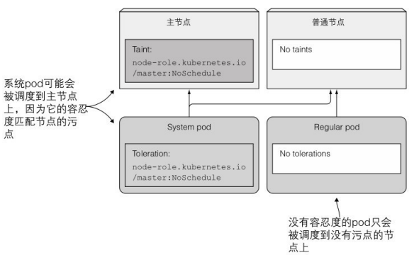
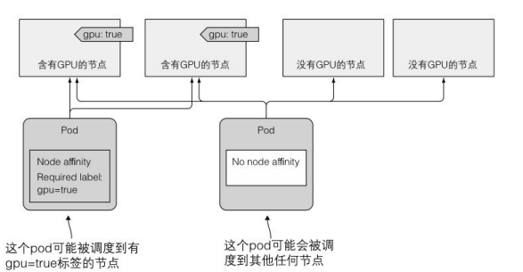
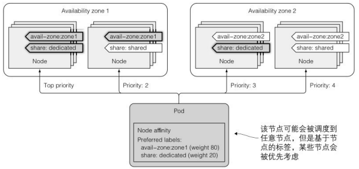
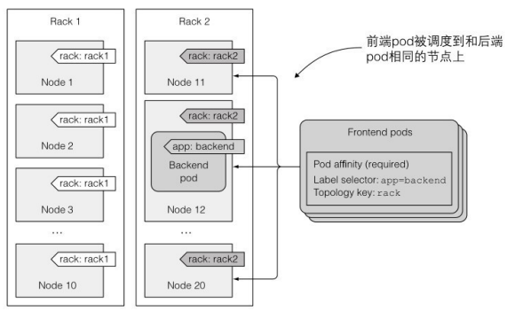
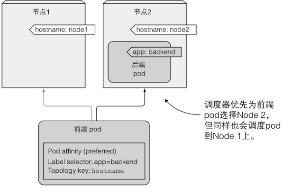

# 第 16 章 高级调度

## 1.使用污点和容忍度阻止节点调度到特定节点

只有当⼀个 pod 容忍某个节点的污点，这个 pod 才能被调度到该节点。污点是在不修改已有 pod 信息的前提下，通过在节点上添加污点信息，来拒绝 pod 在某些节点上的部署。

### 介绍污点和容忍度



#### 污点效果

每⼀个污点都可以关联⼀个效果，效果包含了以下三种：

1. NoSchedule 表⽰如果 pod 没有容忍这些污点，pod 则不能被调度到包含这些污点的节点上。
2. PreferNoSchedule 是 NoSchedule 的⼀个宽松的版本，表⽰尽量阻止 pod 被调度到这个节点上，但是如果没有其他节点可以调度，pod 依然会被调度到这个节点上。
3. NoExecute 不同于 NoSchedule 以及 PreferNoSchedule，后两者只在调度期间起作用，而 NoExecute 也会影响正在节点上运行着的 pod。如果在⼀个节点上添加了 NoExecute 污点，那些在该节点上运行着的 pod，如果没有容忍这个 NoExecute 污点，将会从这个节点去除。

### 在 pod 上添加污点容忍度

```yaml
apiVersion: extensions/v1beta1
kind: Deployment
metadata:
  name: prod
spec:
  replicas: 5
  template:
    metadata:
      labels:
        app: prod
    spec:
      containers:
        - args:
            - sleep
            - "99999"
          image: busybox
          name: main
      tolerations:
        - key: node-type
          operator: Equal
          value: production
          effect: NoSchedule
```

### 了解污点和污点容忍度的使用场景

节点可以拥有多个污点信息，而 pod 也可以有多个污点容忍度。正如你所见，污点可以只有⼀个 key 和⼀个效果，而不必设置 value。污点容忍度可以通过设置 Equal 操作符 Equal 操作符来指定匹配的 value（默认情况下的操作符），或者也可以通过设置 Exists 操作符来匹配污点的 key

例如，可以将⼀个集群分成多个部分，只允许开发团队将 pod 调度到他们特定的节点上。当你的部分节点提供了某种特殊硬件，并且只有部分 pod 需要使用到这些硬件的时候，也可以通过设置污点和容忍度的方式来实现。

你也可以配置⼀个 tolerationSeconds，用于当某个 pod 运行所在的节点变成 unready 或者 unreachable 状态时，Kubernetes 可以等待该 pod 被调度到其他节点的最长等待时间。

## 2.使用节点亲缘性将 pod 调度到特定节点上

节点亲缘性根据节点的标签来进行选择，这点跟节点选择器是⼀致的。
failure-domain.beta.kubernetes.io/region 表⽰该节点所在的地理地域。
failure-domain.beta.kubernetes.io/zone 表⽰该节点所在的可用性区域
（availability zone）。
kubernetes.io/hostname 很显然是该节点的主机名。

### 指定强制性节点亲缘性规则

```yaml
apiVersion: v1
kind: Pod
metadata:
  name: kubia-gpu
spec:
  affinity:
    nodeAffinity:
      requiredDuringSchedulingIgnoredDuringExecution:
        nodeSelectorTerms:
          - matchExpressions:
              - key: gpu
                operator: In
                values:
                  - "true"
  containers:
    - image: luksa/kubia
      name: kubia
```

requiredDuringSchedulingIgnoredDuringExecution （NodeSelector）
如果在调度时不满足该字段指定的亲和性要求，则不会将 Pod 调度到该节点上。 如果在 Pod 执行期间的某个时间点不再满足此字段指定的亲和性要求（例如：由于更新）， 系统可能会或可能不会尝试最终将 Pod 从其节点中逐出。


### 调度 pod 时优先考虑某些节点

想象⼀下你拥有⼀个跨越多个国家的多个数据中心，每⼀个数据中心代表了⼀个单独的可用性区域。在每个区域中，你有⼀些特定的机器，只提供给你自⼰或者你的合作公司使用。现在，你想要部署⼀些 pod，希望将 pod 优先部署在区域 zone1，并且是为你公司部署预留的机器上。如果你的机器没有⾜够的空间用于这些 pod，或者出于其他⼀些重要的原因不希望这些 pod 调度到上⾯，那么就会调度到其他区域的其他机器上⾯，这种情况你也是可以接受的。节点亲缘性就可以实现这样的功能。

preferredDuringSchedulingIgnoredDuringExecution （[]PreferredSchedulingTerm）

调度程序会更倾向于将 Pod 调度到满足该字段指定的亲和性表达式的节点， 但它可能会选择违反一个或多个表达式的节点。最优选的节点是权重总和最大的节点， 即对于满足所有调度要求（资源请求、requiredDuringScheduling 亲和表达式等）的每个节点， 通过迭代该字段的元素来计算总和如果节点匹配相应的 matchExpressions，则将 "权重" 添加到总和中； 具有最高总和的节点是最优选的。

空的首选调度条件匹配所有具有隐式权重 0 的对象（即它是一个 no-op 操作）。 null 值的首选调度条件不匹配任何对象（即也是一个 no-op 操作）。

```yaml
apiVersion: extensions/v1beta1
kind: Deployment
metadata:
  name: pref
spec:
  replicas: 5
  template:
    metadata:
      labels:
        app: pref
    spec:
      affinity:
        nodeAffinity:
          preferredDuringSchedulingIgnoredDuringExecution:
            - weight: 80
              preference:
                matchExpressions:
                  - key: availability-zone
                    operator: In
                    values:
                      - zone1
            - weight: 20
              preference:
                matchExpressions:
                  - key: share-type
                    operator: In
                    values:
                      - dedicated
      containers:
        - args:
            - sleep
            - "99999"
          image: busybox
          name: main
```



## 3.使用 pod 亲缘性与非亲缘性对 pod 进行协同部署

让 Kubernetes 将你的 pod 部署在任何它觉得合适的地方，同时确保 2 个 pod 是靠近的。

### 使用 pod 间亲缘性将多个 pod 部署在同⼀个节点上

将部署 1 个后端 pod 和 5 个包含 pod 亲缘性配置的前端 pod 实例，使得这些前端实例将被部署在后端 pod 所在的同⼀个节点上。

部署后端 pod：

```bash
kubectl run backend -l app=backend --image busybox -- sleep 999999
```

#### 在 pod 定义中指定 pod 亲缘性

前端 pod 的描述:

```yaml
apiVersion: app/v1
kind: Deployment
metadata:
  name: frontend
spec:
  replicas: 5
  template:
    metadata:
      labels:
        app: frontend
    spec:
      affinity:
        podAffinity:
          requiredDuringSchedulingIgnoredDuringExecution:
            - topologyKey: kubernetes.io/hostname
              labelSelector:
                matchLabels:
                  app: backend
      containers:
        - name: main
          image: busybox
          args:
            - sleep
            - "99999"
```


如果现在你删除了后端 pod，调度器会将该 pod 调度到 node2，即便后端 pod 本⾝没有定义任何 pod 亲缘性规则。当调度后端 pod 时，由于 pod 间亲缘性，node2 获得了⽐ node1 更⾼的分数。

### 将 pod 部署在同⼀机柜、可用性区域或者地理地域

#### 在同⼀个可用性区域中协同部署 pod

如果这些节点运行在不同的可用性区域中，那么需要将 topologyKey 属性设置为 failure-domain.beta.kubernetes.io/zone，以确保前端 pod 和后端 pod 运行在同⼀个可用性区域中。

#### 在同⼀个地域中协同部署 pod

为了允许你将 pod 部署在同⼀个地域而不是区域内（云服务提供商通常拥有多个地理地域的数据中⼼，每个地理地域会被划分成多个可用性区域），那么需要将 topologyKey 属性设置为 failure-domain.beta.kubernetes.io/region。

#### 了解 topologyKey 是如何⼯作的

topologyKey 的⼯作方式很简单，⽬前我们提到的 3 个键并没有什么特别的。如果你愿意，可以任意设置自定义的键，例如 rack，为了让 pod 能部署到同⼀个机柜。唯⼀的前置条件就是，在你的节点上加上 rack 标签。
**注意 在调度时，默认情况下，标签选择器只有匹配同⼀命名空间中的 pod。但是，可以通过在 labelSelector 同⼀级添加 namespaces 字段，实现从其他的命名空间选择 pod 的功能。**



### 表达 pod 亲缘性优先级取代强制性要求

你可以告诉调度器，优先将前端 pod 调度到和后端 pod 相同的节点上，但是如果不满⾜需求，调度到其他节点上也是可以的。

```yaml
apiVersion: extensions/v1beta1
kind: Deployment
metadata:
  name: frontend
spec:
  replicas: 5
  template:
    metadata:
      labels:
        app: frontend
    spec:
      affinity:
        podAffinity:
          preferredDuringSchedulingIgnoredDuringExecution:
            - weight: 80
              podAffinityTerm:
                topologyKey: kubernetes.io/hostname
                labelSelector:
                  matchLabels:
                    app: backend
      containers:
        - name: main
          image: busybox
          args:
            - sleep
            - "99999"
```



### 利用 pod 的非亲缘性分开调度 pod

你可能希望 pod 远离彼此。这种特性叫作 pod ⾮亲缘性。
它和 pod 亲缘性的表⽰方式⼀样，只不过是将 podAffinity 字段换成 podAntiAffinity，这将导致调度器永远不会选择那些有包含 podAntiAffinity 匹配标签的 pod 所在的节点。

⼀个为什么需要使用 pod ⾮亲缘性的例子，就是当两个集合的 pod，如果运行在同⼀个节点上会影响彼此的性能。在这种情况下，你需要告知调度器永远不要将这些 pod 部署在同⼀个节点上。另⼀个例子是强制让调度器将同⼀组的 pod 分在在不同的可用性区域或者地域，这样让整个区域或地域失效之后，不会使得整个服务完全不可用。

```yaml
apiVersion: app/v1
kind: Deployment
metadata:
  name: frontend
spec:
  replicas: 5
  template:
    metadata:
      labels:
        app: frontend
    spec:
      affinity:
        podAntiAffinity:
          requiredDuringSchedulingIgnoredDuringExecution:
            - topologyKey: kubernetes.io/hostname
              labelSelector:
                matchLabels:
                  app: frontend
      containers:
        - name: main
          image: busybox
          args:
            - sleep
            - "99999"
```
